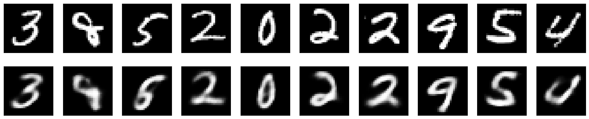
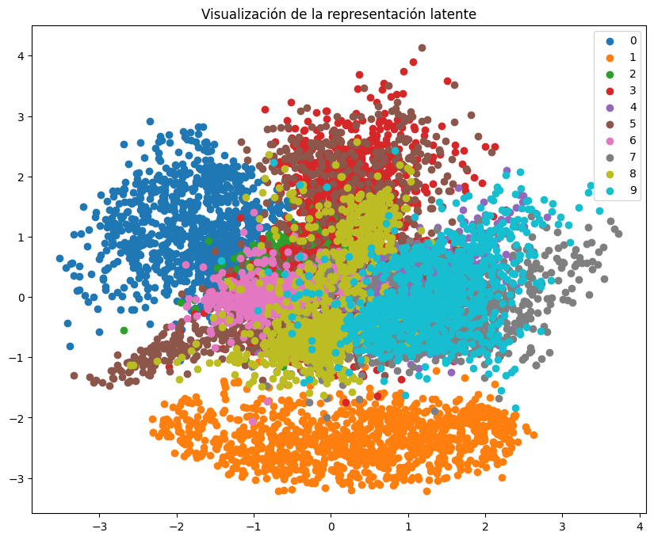
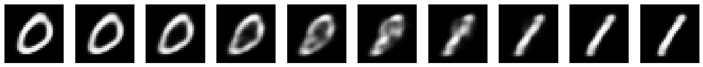
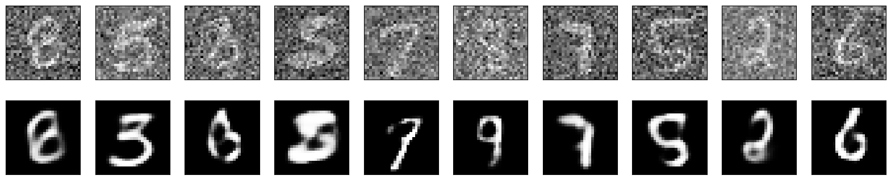
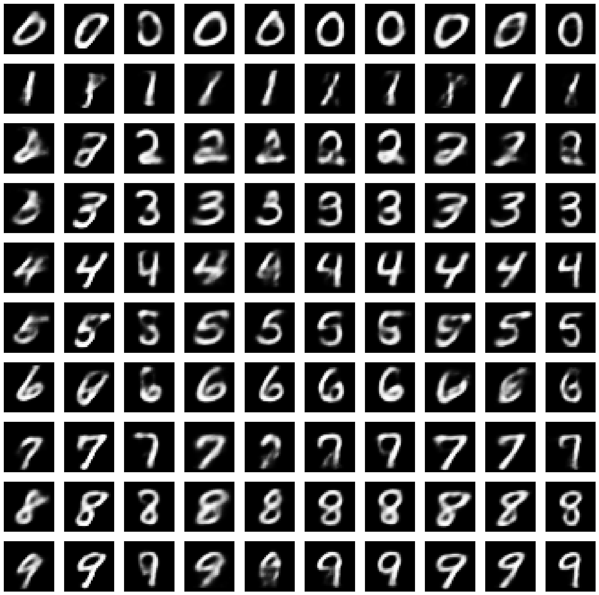

# Variational Autoencoders (VAE) 🚀

This repository explores **Variational Autoencoders (VAEs)** from a probabilistic perspective and demonstrates their performance on the **MNIST** dataset. The work focuses on the theoretical foundations (variational inference, training) and provides a series of experiments to assess **reconstruction**, **visualization**, **interpolation**, **robustness**, **anomaly detection**, and **conditional generation**.

---

## Table of Contents
1. [Overview](#overview)
2. [Key Results](#key-results)
3. [Experiments](#experiments)
   - [Reconstruction](#reconstruction)
   - [Visualization](#visualization)
   - [Interpolation](#interpolation)
   - [Robustness](#robustness)
   - [Anomaly Detection](#anomaly-detection)
   - [Conditional Generation](#conditional-generation)
4. [References](#references)

---

## Overview
A **Variational Autoencoder** is a generative model that learns a latent representation of the data. It uses:
- An **encoder** to map input data \(x\) to latent variables \(z\).
- A **decoder** to reconstruct data from latent variables.

By maximizing the **Evidence Lower BOund (ELBO)**, VAEs ensure high-quality reconstructions while regularizing the latent space to follow a known prior distribution (commonly a Gaussian).

**Core Concepts**:
- **Probabilistic Modeling**: \(p(x|z)\) and \(p(z)\) are learned distributions.
- **Variational Inference**: Approximate \(p(z|x)\) with \(q_\phi(z|x)\) to avoid intractable integrals.
- **ELBO**: \(\mathcal{L}(\theta,\phi)\) balances reconstruction quality and latent-space regularization.

---

## Key Results
- **Average MSE (Noise-Free Reconstruction)**: **0.0173**  
- **Average MSE (With Gaussian Noise)**: **0.0212**  
- **Anomaly Detection**:  
  - **MNIST**: 98.4% accuracy (normal vs. anomalous threshold).  
  - **Fashion-MNIST**: 1.13% accuracy, indicating the model successfully flags this dataset as “anomalous.”  

---

## Experiments

### Reconstruction 🔧
Passing test images through the trained VAE yields an average MSE of **0.0173**.  
Below, the **original** (top) vs. **reconstructed** (bottom) images:

  

### Visualization 🌐
With a **2D latent space**, we can plot the latent variables. Each color corresponds to a digit class, often showing clustered regions with some overlaps:

  

### Interpolation 🔀
By linearly interpolating between two latent representations (e.g., “0” and “1”), the decoder generates a smooth transition:

  

### Robustness 🛡️
Even when images are corrupted with Gaussian noise, the VAE reconstructs them reasonably well (MSE of **0.0212**):

  

### Anomaly Detection ⚠️
Using the distribution of reconstruction errors on MNIST:
- We set a threshold at \(\mu \pm 2\sigma\).
- **MNIST** test achieves ~98.4% correct classification (normal vs. anomalous).
- **Fashion-MNIST** data mostly falls outside the threshold (~1.13% accuracy), indicating it’s anomalous.

### Conditional Generation 🎨
By providing **class labels** (one-hot vectors) to the decoder, we can sample class-specific digits:

  

---

## References
- D. P. Kingma and M. Welling (2013). [Auto-Encoding Variational Bayes](https://doi.org/10.48550/arXiv.1312.6114)  
- S. J. Wetzel (2017). [Unsupervised learning of phase transitions](https://doi.org/10.1103/PhysRevE.96.022140)  
- Q. Zhao *et al.* (2019). [Variational AutoEncoder For Regression](https://doi.org/10.48550/arXiv.1904.05948)  

For further details, please consult the `.tex` file and the cited sources.  
Happy coding and exploring VAEs! ✨  